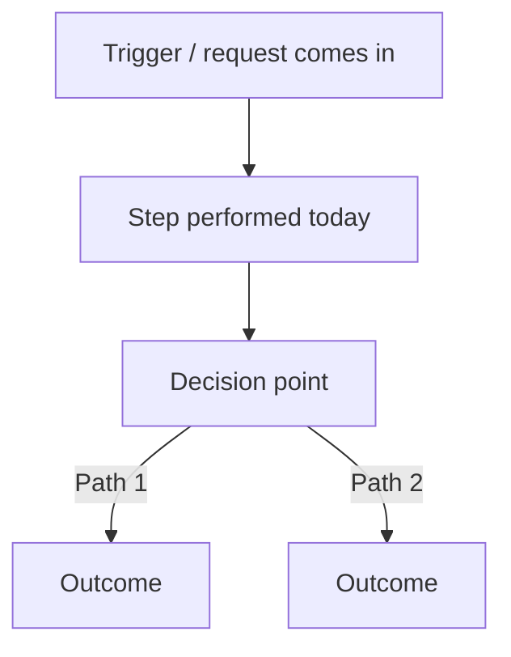
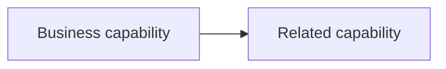

# spec.md — [Request Name] Specification

_Lives at `.spec/[RequestName]/spec.md`_

_Generated by /mia grill — [date]_
_Status: Draft_
_Last updated: [date] via [command]_

---

## 1. Business Context — Status: [Not Started / Unfinished / Confirmed]

**Why now:** [What triggered this project at this point in time]
**Requested by:** [Who asked for this]
**Strategic goal:** [What business outcome this is meant to serve]

---

## 2. As-Is Process — Status: [Not Started / Unfinished / Confirmed]

**Current process:** [How the work gets done today, step by step]
**Current systems/tools:** [What's already in use — name every system explicitly]
**Salesforce context (if applicable):** [Existing objects, flows, automations, integrations relevant to this process — only fill this in if the existing system is actually Salesforce]

---

## 3. Problem Statement — Status: [Not Started / Unfinished / Confirmed]

**Symptom(s) reported:** [What the user first said was wrong]
**Root cause (after drilling):** [What's actually broken, distinguished from the symptom]
**Quantified impact:** [Frequency, scale, cost — concrete numbers where possible, not "sering" or "banyak"]

---

## 4. Stakeholders — Status: [Not Started / Unfinished / Confirmed]

| Name/Role | Relationship to project | Decision authority? |
| --------- | ------------------------ | -------------------- |
| [...]     | User / Approver / Affected / Sponsor | Yes / No |

---

## 5. Customer Expectation & Success Criteria — Status: [Not Started / Unfinished / Confirmed]

**Definition of done (customer's words):** [...]
**Must-have vs nice-to-have:** [...]
**How success will be measured:** [Metric, if one exists]

---

## 6. Scope Boundary — Status: [Not Started / Unfinished / Confirmed]

**In scope:**
- [...]

**Out of scope (explicit):**
- [...]

---

## 7. Constraints & Risks — Status: [Not Started / Unfinished / Confirmed]

**Budget:** [...]
**Timeline:** [...]
**Technical constraints:** [...]
**Compliance/regulatory:** [...]
**Known risks:** [...]
**Logged assumptions (unresolved after 2–3 drill rounds):** [...]

---

## Solution Overview (Conceptual)

_Synthesized once As-Is Process, Scope Boundary, and Stakeholders are Confirmed — not a layer that's interrogated on its own. Business-level only: process flow and capability relationships, never technical architecture._

**Business process flow:**

**Conceptual component/capability relationship (if useful):**

---

## Changelog

_Only populated after Status: Approved. Every entry comes from /mia amend._

| Date | Section | Before | After | Reason | Decision |
| ---- | ------- | ------ | ----- | ------ | -------- |
| [date] | [layer name] | [prior content, summarized] | [new content, summarized] | [what the user said drove this, after interrogation] | Replace / Combine / Rejected |

---

## Note — requirements.md, tasks.md, uat.md, sit.md

These live as sibling files in the same `.spec/[RequestName]/` folder but are **not** part of this template:

- `requirements.md` and `tasks.md` are owned and written by the Architect (which internally uses sf-ba for PRD/user-story writing) — Mia reads them during `/mia verify` but never writes them.
- `uat.md` and `sit.md` are generated by Mia during `/mia verify`, only after both the traceability check and the task-completion check pass. See the main skill file's VERIFY phase for their required format (plain human language for UAT, integration-focused for SIT).
